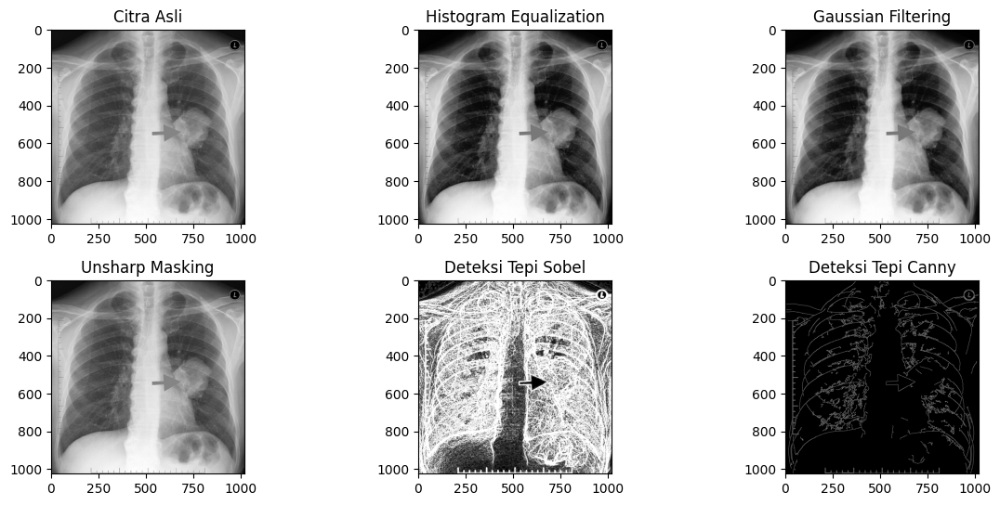

# OpenCV untuk Filtering dan Edge Detection

## ✨ Tentang Proyek

Untuk mengimplementasikan filtering pada gambar, memerlukan fitur spasial, yaitu:
1. Mean Filter (Box Filter): Mengganti nilai setiap piksel dengan nilai rata-rata piksel di sekitarnya. Efektif untuk mengurangi noise, tetapi dapat menyebabkan citra menjadi buram (blur).
2. Gaussian Filter: Menggunakan  kernel yang memiliki distribusi Gaussian (normal). Memberikan bobot lebih besar pada piksel yang dekat ke pusat kernel.
3. Median Filter: Mengganti nilai setiap piksel dengan nilai median dari piksel di sekitarnya. Sangat efektif untuk menghilangkan noise impulsif (salt-and-pepper noise) tanpa terlalu banyak mengaburkan citra. 

Beberapa proses deteksi tepi untuk implementasi Edge Detection diantara lain sebagai berikut:
1. Sobel: Operator Sobel menggunakan kernel untuk menghitung gradien citra dalam arah horizontal dan vertikal. Gradien menunjukkan seberapa cepat intensitas berubah pada setiap titik.
2. Canny: Algoritma deteksi tepi yang lebih canggih.
3. Laplacian: Operator Laplacian menghitung turunan kedua dari intensitas citra. Sensitif terhadap perubahan intensitas yang tajam dan sering digunakan untuk mendeteksi tepi dan detail halus

## Alat
1. Laptop minimal core i 3
2. Koneksi internet (WiFi/Data) 

## Bahan
1. Google Drive, mengimpor modul yang diperlukan untuk bekerja dengan Google Drive di lingkungan Colab,
2. Google Colab, sebagai tempat untuk ngoding secara online,
3. Python, bahasa yang digunakan,
4. Gambar atau foto, sebagai bahan untuk praproses citra dalam bentuk JPG, JPEG, atau PNG, dan
5. Library dalam Colab, beberapa library yang akan digunakan yaitu:
   a. OpenCV, digunakan untuk tugas vision komputer seperti pemrosesan gambar,
   b. Numpy, digunakan untuk operasi numerik khususnya pada array, dan
   c. Matplotlib, digunakan untuk membuat visualisasi menampilkan gambar. 

## 🖼️ Tampilan Hasil

